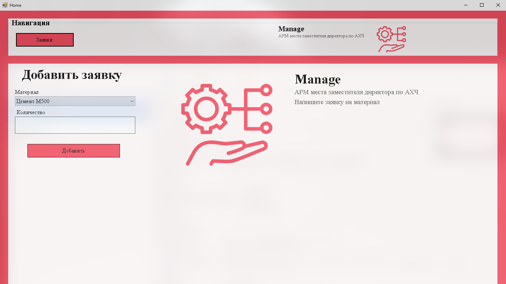
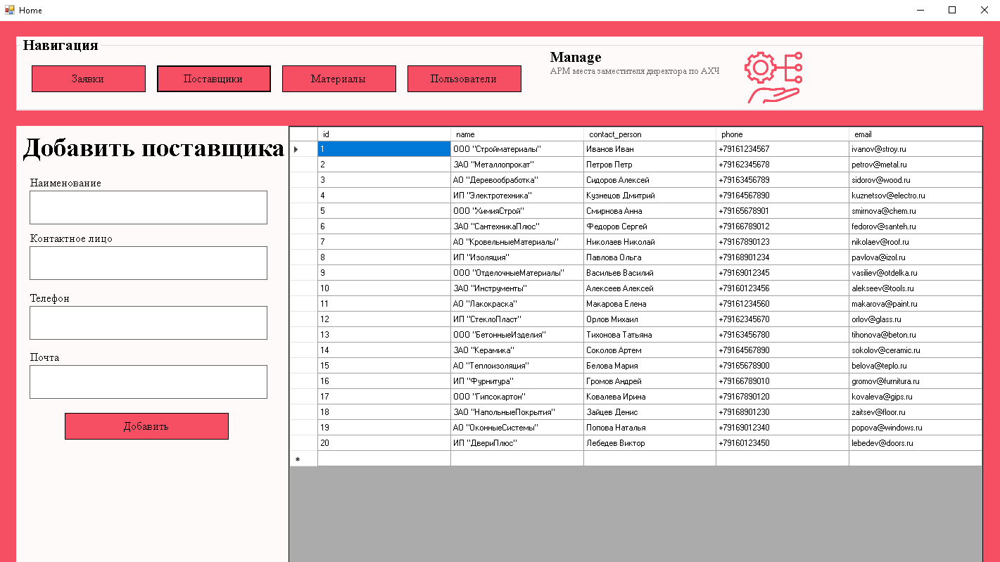
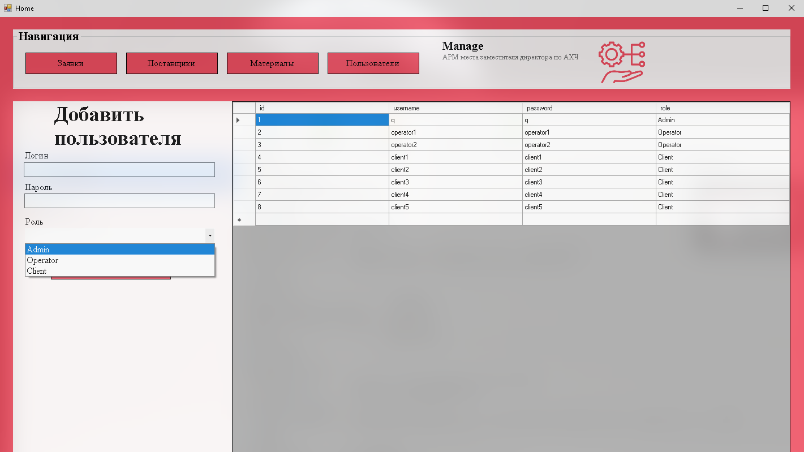
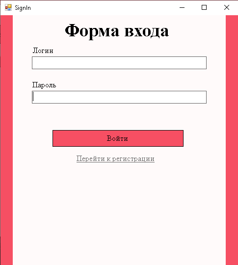

# АРМ заместителя директора по АХЧ

## Описание проекта

Проект представляет собой рабочее место заместителя директора по АХЧ. Система позволяет:

- Отправлять заявления на закупку материалов
- Управлять поставщиками и материалами
- Разграничивать доступ для разных ролей пользователей

## Структура базы данных

### Основные таблицы:

1. **Requests** - Заявки на закупку
2. **Materials** - Имеющиеся материалы
3. **Users** - Пользователи системы
4. **Suppliers** - Поставщики

## Установка и настройка

1. Клонировать репозиторий:
   ```bash
   git clone https://github.com/KaliShau/Coursework-of-classmates.git
   ```

## Использование

Система предоставляет различные возможности в зависимости от роли пользователя:

### Администратор:

- Управление пользователями

### Оператор:

- Добавлять и просматривать заявки
- Добавлять и просматривать поставщиков
- Добавлять и просматривать материалы

### Клиент:

- Добавлять новые заявки

## Картинки










## Контакты

Разработчик: Федоренко Андрей Юрьевич  
ГАПОУ КК «Лабинский аграрный техникум»  
2025 г.
