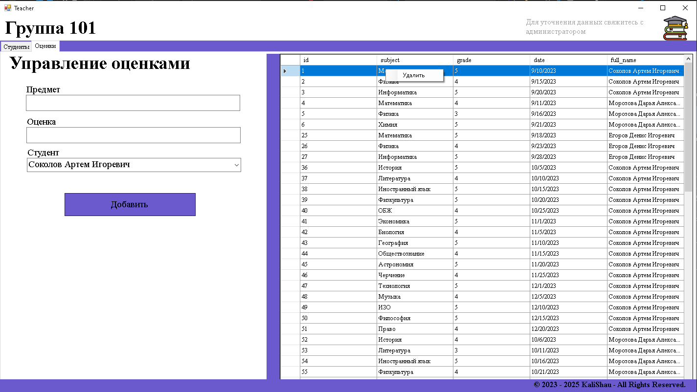

# Учет студентов для классных руководителей

## Описание проекта

Проект представляет собой систему учета студентов для классных руководителей. Система позволяет:

- Просматривать оценки студентам
- Просматривать список студентов и добавлять оценки
- Управлять группами, пользователями и студентами

## Структура базы данных

### Основные таблицы:

1. **groups** - Группы студентов
2. **students** - Студенты
3. **users** - Пользователи системы
4. **grades** - Оценки студентов

## Установка и настройка

1. Клонировать репозиторий:
   ```bash
   git clone https://github.com/KaliShau/Coursework-of-classmates.git
   ```

## Использование

Система предоставляет различные возможности в зависимости от роли пользователя:

### Администратор:

- Управление пользователями
- Управление группами
- Управление студентами

### Учитель:

- Просматривать список студентов
- Добавлять и просматривать оценки

### Студент:

- Просматривать оценки

## Картинки





## Контакты

Разработчик: Федоренко Андрей Юрьевич  
ГАПОУ КК «Лабинский аграрный техникум»  
2025 г.
