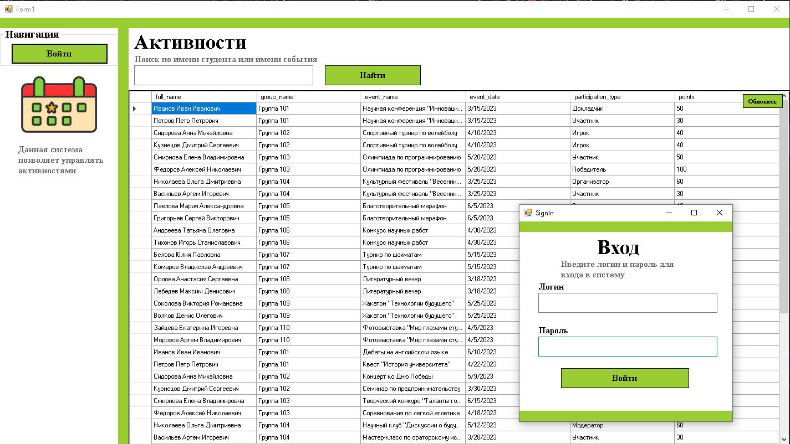
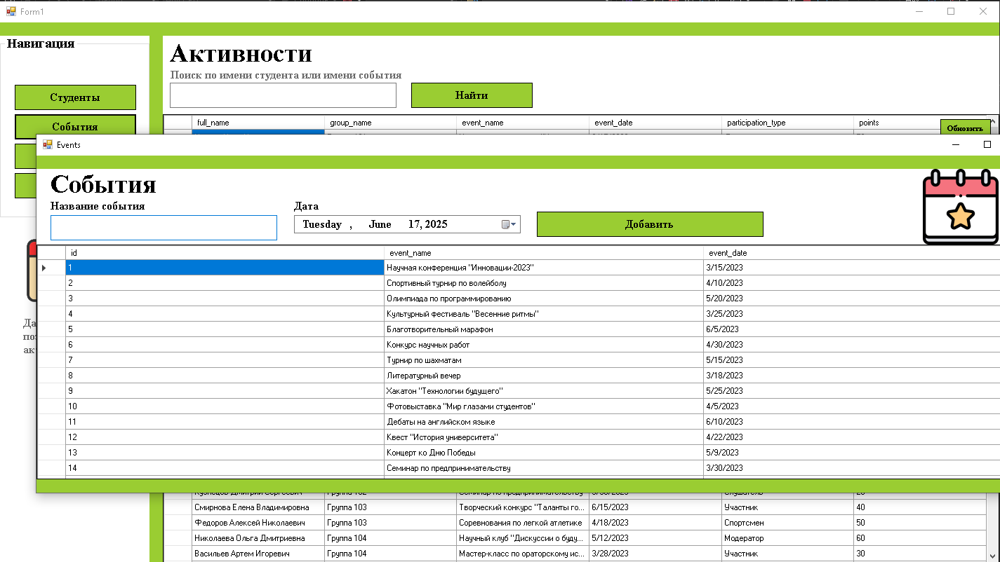
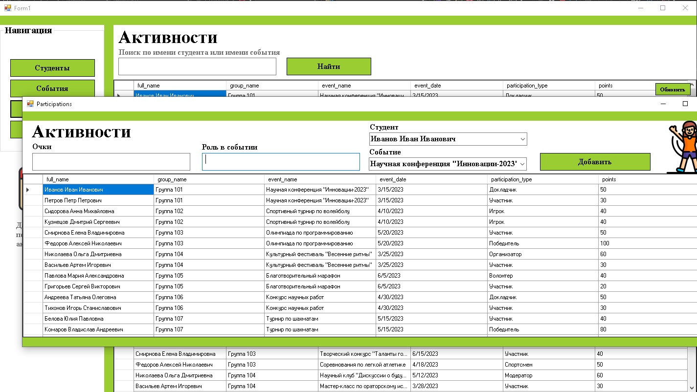
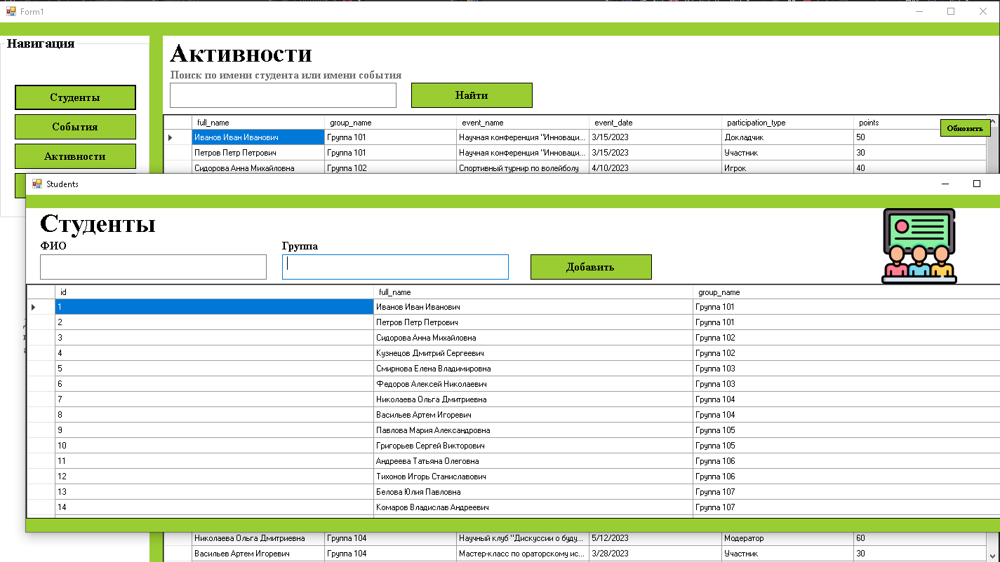
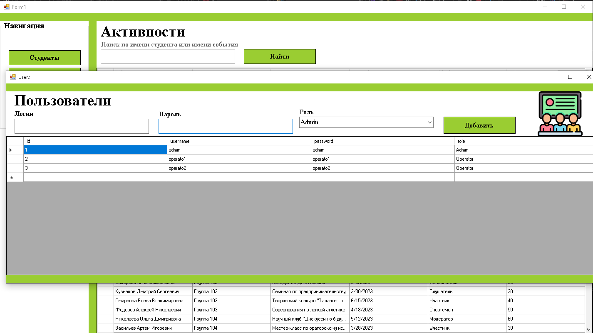

# Учет и анализ активности участия обучающихся в мероприятиях

## Описание проекта

Проект представляет собой систему учета активности участия обучающихся в мероприятиях. Система позволяет:

- Добавлять и отслеживать события
- Разграничивать доступ для разных ролей пользователей
- Добавлять и отслеживать события
- Управлять студентами

## Структура базы данных

### Основные таблицы:

1. **students** - Студенты
2. **TypesWork** - Виды выполняемых работ (Ремонт, Уборка, Монтаж и др.)
3. **events** - События
4. **participation** - Активности (активность студентов)

## Установка и настройка

1. Клонировать репозиторий:
   ```bash
   git clone https://github.com/KaliShau/Coursework-of-classmates.git
   ```

## Использование

Система предоставляет различные возможности в зависимости от роли пользователя:

### Администратор:

- Управление пользователями

### Оператор:

- Добавлять и отслеживать события
- Добавлять и отслеживать активности
- Добавлять и отслеживать студентов

## Картинки











## Контакты

Разработчик: Федоренко Андрей Юрьевич  
ГАПОУ КК «Лабинский аграрный техникум»  
2025 г.
