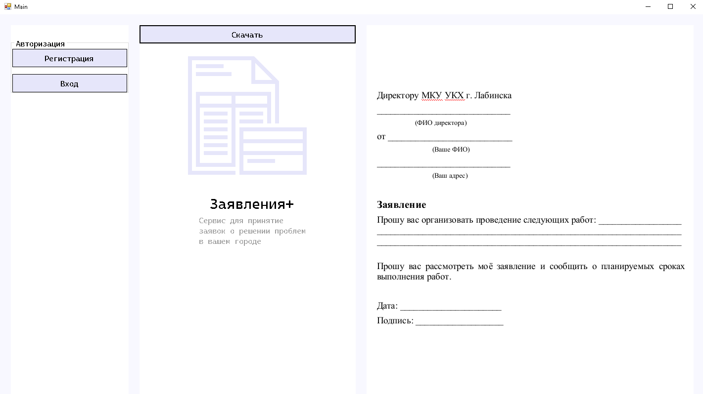
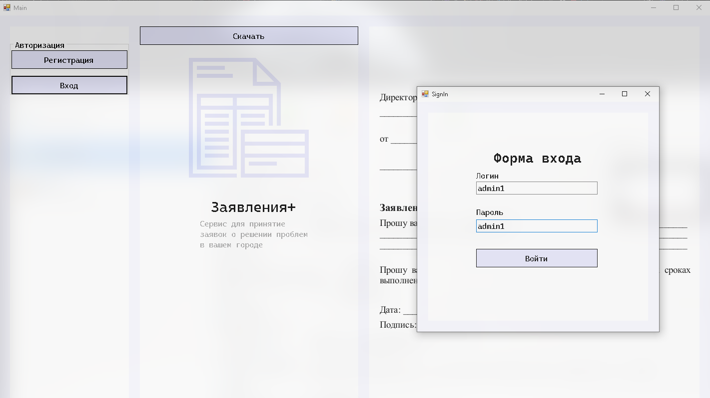
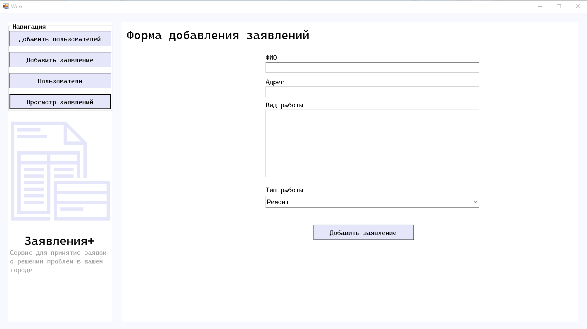
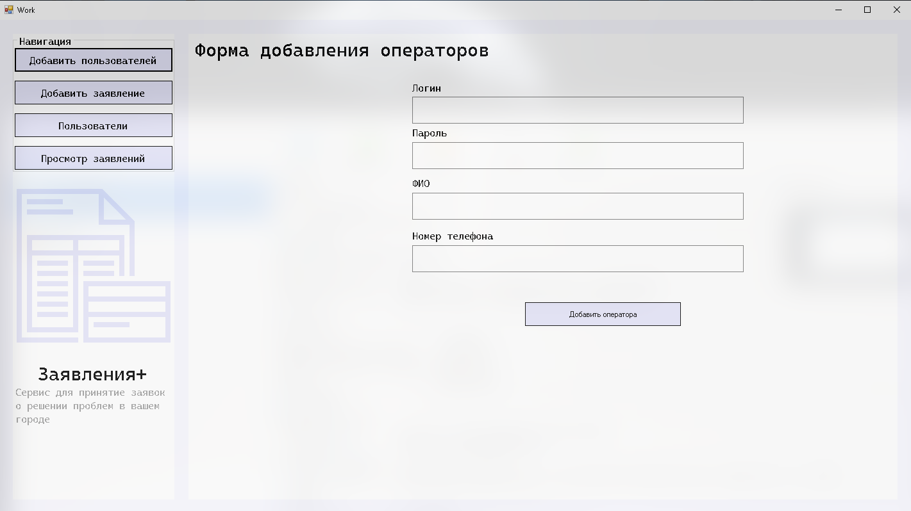
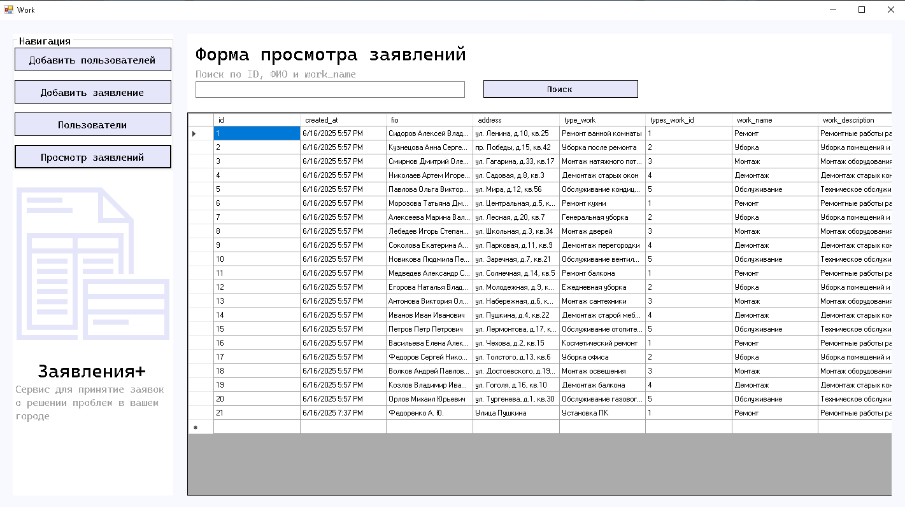

# Учет запросов населения в МКУ УКХ г. Лабинска

## Описание проекта

Проект представляет собой систему учета запросов населения в муниципальное казенное учреждение "Управление коммунального хозяйства" города Лабинска. Система позволяет:

- Регистрировать заявления от жителей
- Разграничивать доступ для разных ролей пользователей
- Отслеживать заявления

## Структура базы данных

### Основные таблицы:

1. **Roles** - Роли пользователей системы (Администратор, Оператор, Клиент)
2. **TypesWork** - Виды выполняемых работ (Ремонт, Уборка, Монтаж и др.)
3. **Users** - Пользователи системы
4. **Statements** - Заявления от населения

## Установка и настройка

1. Клонировать репозиторий:
   ```bash
   git clone https://github.com/KaliShau/Coursework-of-classmates.git
   ```

## Использование

Система предоставляет различные возможности в зависимости от роли пользователя:

### Администратор:

- Управление пользователями
- Просмотр всех заявлений

### Оператор:

- Регистрация новых заявлений
- Просмотр статусов заявлений
- Поиск и фильтрация заявлений

### Клиент:

- Отправка новых заявлений

## Картинки










