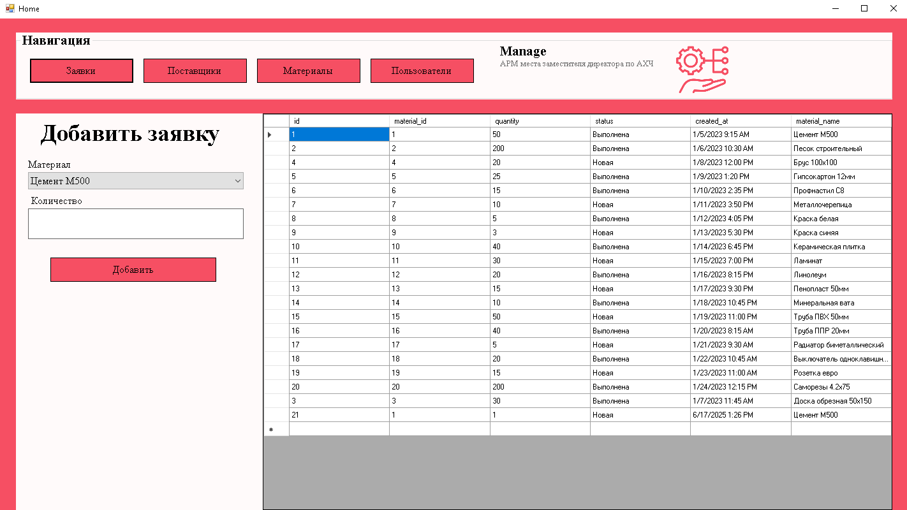
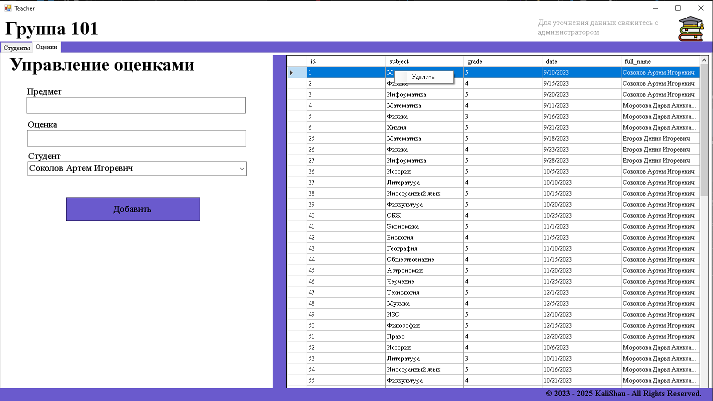

# Репозиторий курсовых работ одногрупников

## Описание репозитория

Этот репозиторий создан для хранения и организации курсовых работ одногрупников. Здесь собраны проекты, выполненные в рамках учебного процесса.

### Основные цели репозитория:

- Централизованное хранение курсовых работ.

## Технологии и инструменты

- **Язык программирования**: C#
- **Среда разработки**: Visual Studio Community
- **Система управления базами данных (СУБД)**: PostgreSQL
- **Библиотека для работы с БД**: Npgsql (ADO.NET для PostgreSQL)
- **Диаграммы и модели**: ER-диаграммы, UML

## Курсовые работы

1. **Подолянов Глеб** - Учет запросов MCU ([Link](./PodolyanovGleb/README.md))
   

2. **Березкин Артем** - АРМ заместителя директора по АХЧ ([Link](./BerezkinArtem/README.md))
   

3. **Громова Элина** - Учет студентов для классных руководителей ([Link](./GromovaElina/README.md))
   
